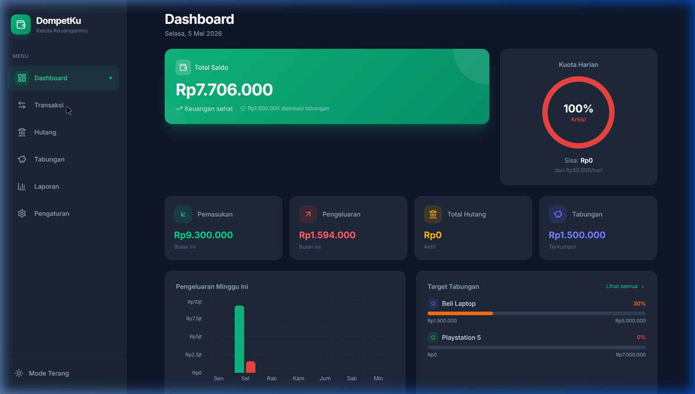
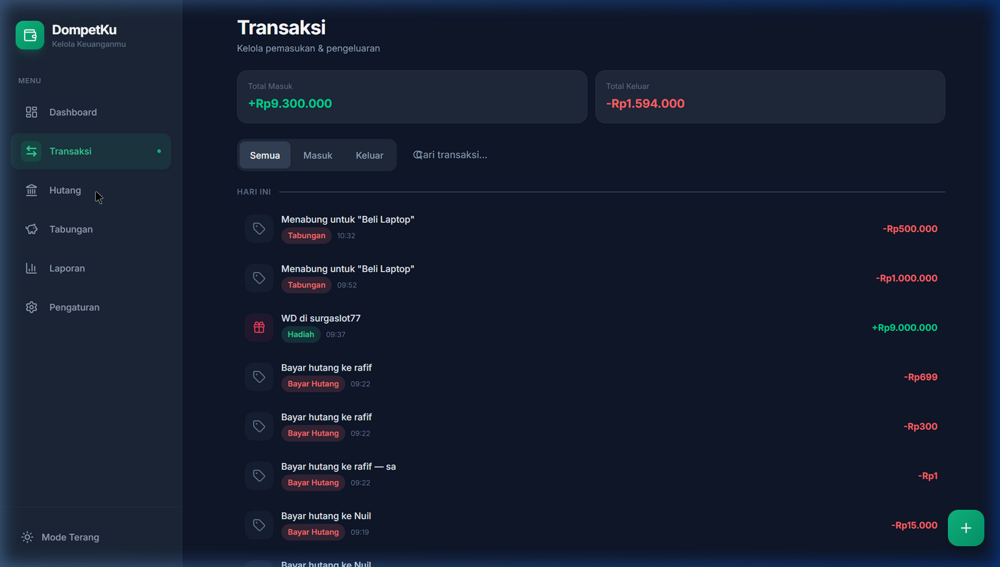
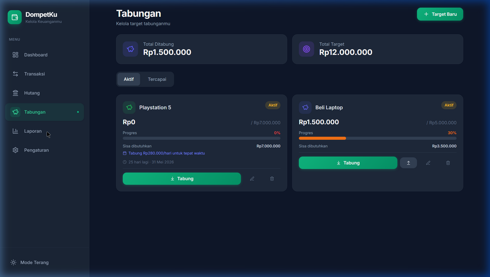
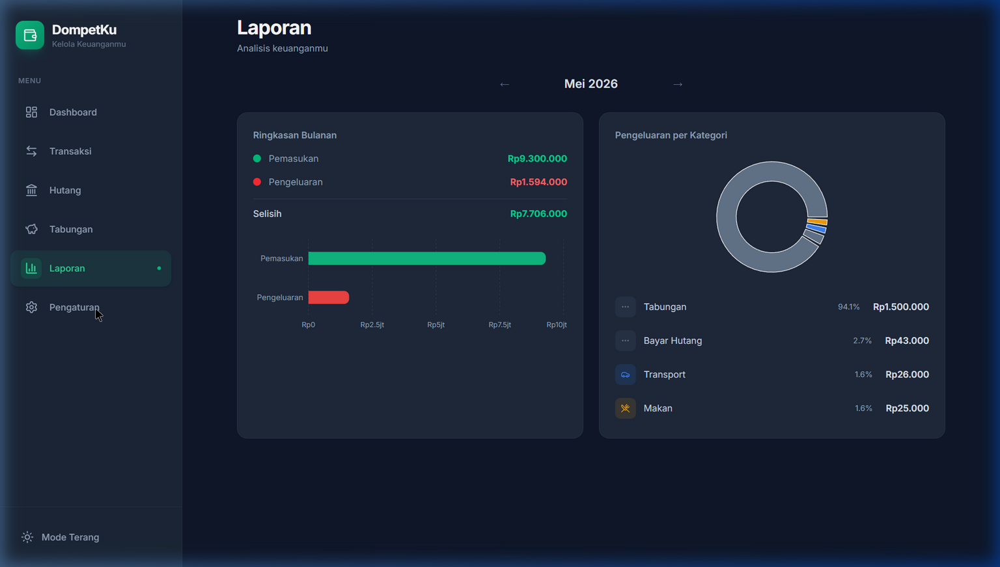

<p align="center">
  
</p>

<h1 align="center">DompetKu</h1>

<p align="center">
  <strong>Manajemen Keuangan Pribadi — 100% Local, 100% Private</strong>
</p>

<p align="center">
  
  
  
  
  
</p>

---

**DompetKu** adalah platform manajemen keuangan pribadi berbasis web yang mengutamakan **privasi data** dan **kemandirian sistem**. Seluruh data tersimpan 100% di perangkat pengguna menggunakan IndexedDB — tanpa server, tanpa pihak ketiga, tanpa tracking.

---

## 📸 Screenshots

### Dashboard


### Transaksi


### Tabungan


### Laporan


---

## ✨ Fitur Utama

### 💰 Manajemen Saldo & Pemasukan
- Input manual pemasukan dengan sumber dan kategori
- Pencatatan nominal, deskripsi, dan tanggal
- Format Rupiah otomatis (auto-formatting)

### 📊 Pelacakan Pengeluaran
- Kategorisasi detail (Makan, Transport, Listrik, Hiburan, dll)
- Log transaksi lengkap dengan waktu, nominal, dan deskripsi
- Filter: Semua / Masuk / Keluar
- Pencarian cepat berdasarkan deskripsi atau kategori
- Pengelompokan otomatis berdasarkan tanggal

### 🏦 Manajemen Hutang
- Pencatatan hutang dengan nama pemberi, nominal, dan jatuh tempo
- Progress bar pembayaran (terbayar / total)
- Bayar sebagian atau langsung lunas
- Auto-status: Aktif → Lunas saat hutang terbayar penuh
- Deteksi jatuh tempo & indikator keterlambatan
- **Pembayaran hutang otomatis mengurangi saldo utama**

### 🐷 Target Tabungan (Savings Goal)
- Tetapkan target finansial (nama + nominal + tanggal opsional)
- Akumulasi dana bertahap dari saldo yang ada
- Progress bar dinamis yang berubah warna (🔴→🟠→🟡→🟢→✅)
- Estimasi harian: *"Tabung RpXXX/hari untuk tepat waktu"*
- Status Aktif / Tercapai (auto-update)
- Tarik dana kembali ke saldo jika diperlukan
- **Menabung otomatis mengurangi saldo utama**

### 📈 Laporan & Analisis
- Navigasi per bulan
- Ringkasan pemasukan vs pengeluaran
- Bar chart perbandingan horizontal
- Donut chart pengeluaran per kategori dengan persentase

### 🎯 Smart Budget Alert
- Batas anggaran harian yang bisa dikustomisasi
- 3 level peringatan:
  - 🟢 **Aman** (< 70%)
  - 🟡 **Peringatan** (70% - 90%)
  - 🔴 **Kritis** (> 90%)
- Banner alert real-time di atas layout

### 💾 Backup & Restore
- Ekspor seluruh data ke file JSON
- Impor data dari backup JSON
- Hapus semua data (dengan konfirmasi ganda)

### 🎨 Tampilan
- **Dark Mode** / Light Mode / Ikuti Sistem
- Desain premium dengan glassmorphism
- Animasi smooth dan micro-interactions
- Responsive: Mobile (bottom nav) + Desktop (sidebar)
- PWA — bisa diinstall seperti aplikasi native

---

## 🛡️ Privasi & Keamanan

| Aspek | Detail |
|-------|--------|
| Penyimpanan Data | 100% lokal di perangkat (IndexedDB) |
| Server | Tidak ada — zero server calls |
| Tracking | Tidak ada analytics atau tracking |
| Sinkronisasi | Tidak ada — data tidak pernah meninggalkan device |
| Backup | Manual via file JSON yang Anda kontrol sendiri |

---

## 🛠️ Tech Stack

| Layer | Teknologi |
|-------|-----------|
| **Build Tool** | [Vite 8](https://vite.dev/) |
| **Framework** | [React 19](https://react.dev/) |
| **Routing** | [React Router v7](https://reactrouter.com/) |
| **Styling** | [Tailwind CSS v4](https://tailwindcss.com/) |
| **Database** | [Dexie.js v4](https://dexie.org/) (IndexedDB wrapper) |
| **Charts** | [Recharts](https://recharts.org/) |
| **Icons** | [Lucide React](https://lucide.dev/) |
| **PWA** | [vite-plugin-pwa](https://vite-pwa-org.netlify.app/) |
| **Date** | [date-fns](https://date-fns.org/) |
| **Notifications** | [react-hot-toast](https://react-hot-toast.com/) |

---

## 🚀 Quick Start

### Prerequisites
- [Node.js](https://nodejs.org/) v18+
- npm v9+

### Installation

```bash
# Clone repository
git clone https://github.com/your-username/manage-uang.git
cd manage-uang

# Install dependencies
npm install --legacy-peer-deps

# Start development server
npm run dev
```

Buka `http://localhost:5173/` di browser.

### Build Production

```bash
npm run build
npm run preview
```

---

## 📁 Struktur Proyek

```
src/
├── components/
│   ├── common/         # Modal, FAB, CurrencyInput, ConfirmDialog, EmptyState
│   ├── layout/         # AppLayout, Sidebar, BottomNav, Header
│   ├── dashboard/      # BalanceCard, BudgetGauge, SpendingChart, QuickStats,
│   │                   # RecentTransactions, SavingsWidget
│   ├── transactions/   # TransactionForm, TransactionList, TransactionItem,
│   │                   # CategoryPicker
│   ├── debts/          # DebtForm, DebtList, DebtItem, DebtPaymentForm
│   ├── savings/        # SavingsForm, SavingsList, SavingsItem, SavingsDepositForm
│   └── budget/         # BudgetAlert
├── db/
│   ├── db.js           # Dexie database singleton + schema
│   ├── useTransactions.js
│   ├── useDebts.js
│   ├── useSavings.js
│   └── useSettings.js
├── hooks/
│   └── useTheme.js     # Dark/Light/System mode
├── pages/
│   ├── Dashboard.jsx
│   ├── Transactions.jsx
│   ├── Debts.jsx
│   ├── Savings.jsx
│   ├── Reports.jsx
│   └── Settings.jsx
├── utils/
│   ├── formatCurrency.js
│   ├── categories.js
│   ├── budgetCalculator.js
│   ├── dateHelpers.js
│   └── backup.js
├── App.jsx
├── main.jsx
└── index.css           # Design system (Tailwind v4 + custom utilities)
```

---

## 🗄️ Database Schema

```
transactions    : ++id, type, category, date, amount, description, createdAt
debts           : ++id, creditorName, totalAmount, paidAmount, dueDate, status, createdAt
debtPayments    : ++id, debtId, amount, date, note
savings         : ++id, name, targetAmount, savedAmount, targetDate, status, color, createdAt
savingsDeposits : ++id, savingsId, amount, date, note
settings        : id
categories      : ++id, name, icon, color, type
```

---

## 📝 Logika Kunci

### Perhitungan Saldo
```
Saldo = Σ Pemasukan - Σ Pengeluaran
```
Pembayaran hutang dan deposit tabungan otomatis tercatat sebagai **pengeluaran**, sehingga saldo berkurang secara otomatis.

### Budget Alert
```
usage = pengeluaran hari ini / batas harian × 100%
< 70%  → 🟢 Aman
70-90% → 🟡 Peringatan
> 90%  → 🔴 Kritis
```

### Estimasi Tabungan Harian
```
sisa = targetAmount - savedAmount
hariTersisa = targetDate - today
tabunganPerHari = ⌈sisa / hariTersisa⌉
```

---

## 📄 License

MIT License — Bebas digunakan dan dimodifikasi.

---

<p align="center">
  <strong>DompetKu</strong> · v1.0.0 · Data Anda, Kontrol Anda 🔒
</p>
